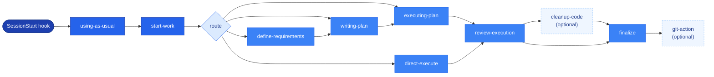

<div align="center">

<h1>🧭 AsUsual</h1>

<p><strong><em>Controlled</em> AI-assisted development — from requirements to tests to done, in one workflow.</strong></p>

<p>
  
  
  
  
  
</p>

<p>
  <a href="#-why-asusual"><b>Why</b></a> ·
  <a href="#-how-it-works"><b>Workflow</b></a> ·
  <a href="#-topic-artifacts"><b>Artifacts</b></a> ·
  <a href="#-install"><b>Install</b></a> ·
  <a href="#-smoke-test"><b>Smoke Test</b></a> ·
  <a href="#-project-layout"><b>Layout</b></a>
</p>

</div>

---

<table>
<tr>
<td width="60" align="center">💡</td>
<td>
AsUsual is designed for <strong>controlled AI-assisted development</strong> on work that may eventually affect real, always-on production services. It is intentionally <em>not</em> a pure vibe-coding harness — it keeps topic-level decisions in files so the agent never has to guess your existing work style.
</td>
</tr>
</table>

> The harness succeeds when you can understand **what was decided, why, what changed, what was verified, what risk remains, and what action is still waiting.**
>
> See [`PROJECT_IDENTITY.md`](PROJECT_IDENTITY.md) for the full project identity and design principles.

<br>

## ✨ Why AsUsual

<table>
<thead>
<tr><th align="left">Guarantee</th><th align="left">What it prevents</th></tr>
</thead>
<tbody>
<tr><td>🛑 <strong>Stop before guessing</strong></td><td>Unclear intent is never silently turned into implementation — broad ambiguity goes through file-backed <code>define-requirements</code> questions.</td></tr>
<tr><td>📌 <strong>Durable decisions</strong></td><td>User decisions are preserved as topic artifacts on disk, not lost in chat memory.</td></tr>
<tr><td>🔌 <strong>Impact, surfaced early</strong></td><td>DB / API / external-behavior impact is exposed <em>before</em> code is written.</td></tr>
<tr><td>🔐 <strong>Explicit approval</strong></td><td>High-risk operations require fresh approval — appearing in an approved plan is not enough.</td></tr>
<tr><td>🧪 <strong>Evidence over optimism</strong></td><td>Verification evidence is recorded instead of relying on a hopeful "looks done" summary.</td></tr>
<tr><td>🔍 <strong>Review before finalize</strong></td><td>Actual changes are reviewed against recorded evidence before a topic is closed.</td></tr>
</tbody>
</table>

<sub>🌐 Language-neutral by design — AsUsual is not tied to any one stack, framework, or architecture, and it does <strong>not</strong> force the workflow onto every request just because the plugin is installed.</sub>

<br>

## 🔄 How It Works

The runtime workflow rules live in [`as-usual-rules/core-workflow.md`](as-usual-rules/core-workflow.md) — read by the agent on disk, **never copied into target projects**.



<details>
<summary><b>📖 Step-by-step (text fallback)</b></summary>

<br>

```text
SessionStart hook
  → using-as-usual
  → start-work
  → define-requirements | writing-plan | executing-plan | direct-execute
  → review-execution
  → optional cleanup-code
  → finalize
  → optional git-action
```

1. **define-requirements** — write `question-cN.md` only when material ambiguity exists; you answer in `[Answer]:` fields; the agent synthesizes a single `requirements.md`.
2. **writing-plan** — produce one `plan.md` from the approved requirements.
3. **executing-plan** — implement via `inline`, `subagent-driven`, or `mixed` mode; the main agent stays the controller for order, evidence, and completion claims.
4. **review-execution** — mandatory review of real changes against recorded evidence.
5. **cleanup-code** — optional, user-approved code cleanup.
6. **finalize** — close the topic record and pick a post-finalize git action.

For the full architecture, stages, and prompt/template path map, see [`docs/ARCHITECTURE-WORKFLOW.md`](docs/ARCHITECTURE-WORKFLOW.md).

</details>

<br>

## 📂 Topic Artifacts

In target projects, create **only** topic artifacts under `.as-usual/topic/yyyy-MM-dd-<topic>/`:

```text
.as-usual/
└── topic/
    └── yyyy-MM-dd-<topic>/
        ├── topic.md              # agent-first, low-churn resume document
        ├── audit.jsonl           # canonical append-only event log
        ├── question-c1.md        # define-requirements clarification cycle
        ├── question-c2.md
        ├── requirements.md       # single synthesized requirements doc
        ├── plan.md               # single execution contract
        ├── code-review-report.md
        └── report.md
```

> [!NOTE]
> `topic.md` is a low-churn resume document — not a task list. Current phase and next action are **derived** with `scripts/topic-log.py status --json`, not maintained by hand.

<br>

## 🚀 Install

<table>
<tr>
<th align="left">Host</th>
<th align="left">Guide</th>
</tr>
<tr>
<td>🤖 <b>Claude Code</b></td>
<td><a href="docs/CLAUDE-PLUGIN-SETTING.md"><code>docs/CLAUDE-PLUGIN-SETTING.md</code></a></td>
</tr>
<tr>
<td>🧠 <b>Codex</b></td>
<td><a href="docs/CODEX-PLUGIN-SETTING.md"><code>docs/CODEX-PLUGIN-SETTING.md</code></a></td>
</tr>
</table>

For local Codex marketplace development, create the symlink `plugins/as-usual -> ..` as described in [`docs/CODEX-PLUGIN-SETTING.md`](docs/CODEX-PLUGIN-SETTING.md).

<br>

## ✅ Smoke Test

```bash
claude plugin details as-usual@as-usual-local
codex plugin list | grep -E 'as-usual|as-usual-local'
CLAUDE_PLUGIN_ROOT="$PWD" hooks/run-hook.cmd session-start | jq .
```

<br>

## 🗂 Project Layout

```text
as-usual/
├── as-usual-rules/core-workflow.md   # canonical runtime workflow (read on disk)
├── .agents/                          # Codex marketplace + maintainer-only skills
├── .claude-plugin/                   # Claude plugin + local marketplace manifest
├── .codex-plugin/                    # Codex plugin manifest
├── hooks/                            # SessionStart hook + shared runner
├── skills/                           # stable public runtime skills
├── docs/                             # install + architecture guides
└── templates/                        # topic artifact templates
```

<br>

<div align="center">
<sub>Built as an agent harness for <b>Claude Code</b> and <b>Codex</b> · Licensed under <a href="https://github.com/HSRyuuu/harness-as-usual">MIT</a></sub>
</div>
